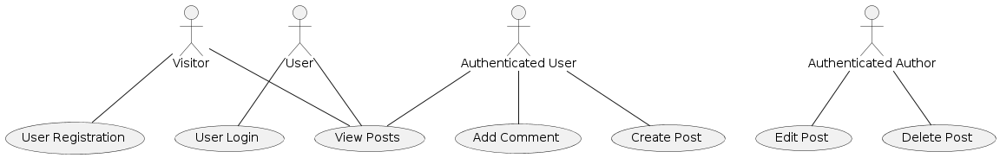
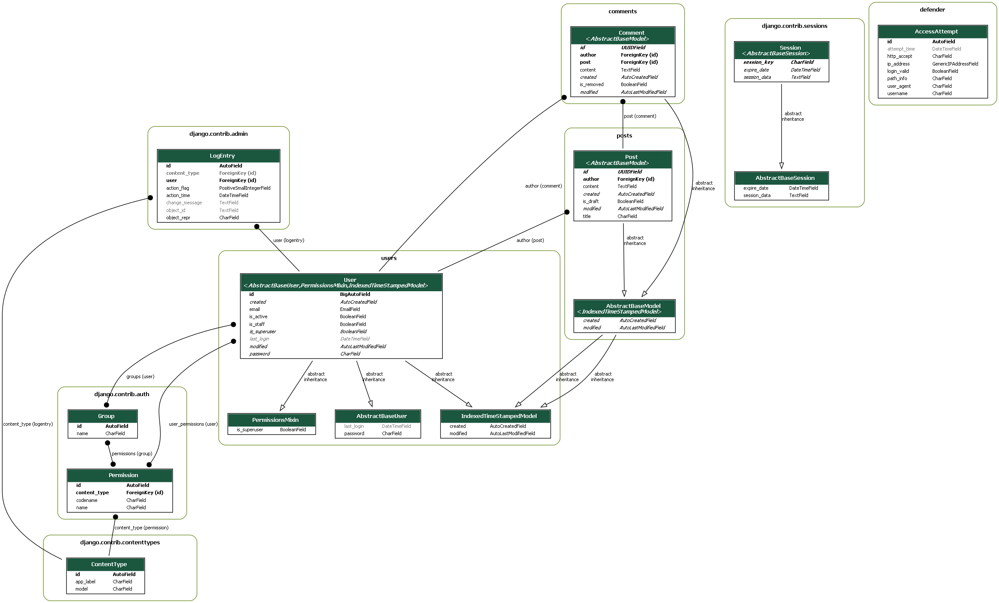

# Blog MVP

## Project description

This is an MVP (Minimum Viable Product) of a blog where users can create, read, 
delete posts and comment on other people's posts. The project is developed using 
Python Django on the backend and React on the frontend.

## Prototype goals

- Create a simple, functional blog where users can interact with posts and comments.
- Focus on usability and essential functionalities.

## Use Cases

### 1. User Registration
**Actor**: Visitor  
**Description**: A visitor creates a new user account to access additional blog features.

**Main Flow**:
1. Visitor accesses the registration page.
2. Visitor fills out the form with a username, email, and password.
3. System validates the information and creates a new user account.
4. System redirects the user to the login page.

**Alternate Flows**:
- 2a. Visitor provides invalid information and the system returns error messages.

### 2. User Login
**Actor**: User  
**Description**: An existing user logs in to access their account and restricted blog features.

**Main Flow**:
1. User accesses the login page.
2. User fills out the form with their username and password.
3. System validates the credentials and authenticates the user.
4. System redirects the user to the main blog page.

**Alternate Flows**:
- 2a. User provides invalid credentials and the system returns error messages.

### 3. Create Post
**Actor**: Authenticated User  
**Description**: An authenticated user creates a new blog post.

**Main Flow**:
1. Authenticated user accesses the create post page.
2. User fills out the form with the title, content, and post status (draft or published).
3. System validates the information and creates the post.
4. System redirects the user to the view of the new post.

**Alternate Flows**:
- 2a. User provides invalid information and the system returns error messages.

### 4. View Posts
**Actor**: Visitor/User  
**Description**: A visitor or user views a list of published posts or the details of a specific post.

**Main Flow**:
1. Visitor/User accesses the main blog page.
2. System displays a list of published posts.
3. Visitor/User clicks on a post to see more details.
4. System displays the full content of the selected post.

**Alternate Flows**: None.

### 5. Edit Post
**Actor**: Authenticated Author  
**Description**: An authenticated author edits one of their existing posts.

**Main Flow**:
1. Author accesses the edit post page.
2. Author modifies the title, content, or status of the post.
3. System validates the changes and updates the post.
4. System redirects the author to the view of the updated post.

**Alternate Flows**:
- 2a. Author provides invalid information and the system returns error messages.

### 6. Delete Post
**Actor**: Authenticated Author  
**Description**: An authenticated author deletes one of their existing posts.

**Main Flow**:
1. Author accesses the page of the post to be deleted.
2. Author clicks the delete button.
3. System confirms the action with the author.
4. System deletes the post and redirects the author to the list of posts.

**Alternate Flows**:
- 3a. Author cancels the delete action.

### 7. Add Comment
**Actor**: Authenticated User  
**Description**: An authenticated user adds a comment to a post.

**Main Flow**:
1. Authenticated user accesses the post page.
2. User fills out the comment form.
3. System validates the comment and adds it to the post.
4. System displays the new comment on the post page.

**Alternate Flows**:
- 2a. User provides invalid information and the system returns error messages.

## Backend Project Visualized

## Core Technologies

1. **Backend**: Django (Python framework)
2. **Frontend**: React (JavaScript framework)
3. **Database**:
   - Primary: Choose one from SQLite, Postgres (based on project needs - consider scalability, features)
   - Secondary (optional): Redis (for caching, real-time messaging)
4. **Distributed Task Queue**: Celery (for asynchronous tasks)
5. **Message Broker**: Redis (coordinates communication between services)

## Development Environment

1. **Dependency Management**: Poetry (Python package manager)
2. **Containerization**: Docker (for packaging and deployment)
3. **Testing**:
   - Unit Testing:
     - Backend: Django Test Framework / pytest
     - Frontend: Jest (Implemented as needed)
   - Integration Testing: (Implemented as needed)
   - End-to-End Testing: (Implemented as needed) 
4. **CI/CD**: GitHub Actions (for automated builds, testing, and deployment)
5. **Deployment**: Cloud provider of choice (Heroku, AWS, GCP)
6. **Monitoring**: Sentry (error tracking) (optional)
7. **Logging**: Django logging framework (centralized logging) (Implemented as needed)

## Frontend

- **Framework**: React
- **Rendering**: react-dom
- **Page Navigation**: react-router
- **Bundling**: webpack
- **Asset Tracking**: webpack-bundle-tracker
- **Styling**:
  - Bootstrap (for responsive stylesheets)
  - react-bootstrap (for components)
  - SCSS (using sass)
- **State Management and Backend Integration**:
  - Asynchronous Calls: axios
  - Cookie Management: cookie
  - TypeScript Client API: openapi-ts
  - Browser History: history
- **Utilities**:
  - General Utility Functions: lodash
  - CSS Class Management: classnames
  - Development Enhancement: react-refresh

## Backend

- **Framework**: Django (Python)
- **REST API Framework**: Django REST Framework (DRF)
- **OpenAPI Schema Generation**: drf-spectacular
- **Rendering Bundled Frontend Assets**: django-webpack-loader
- **Handling Django URLs in JS**: django-js-reverse
- **Django Code Upgrade**: django-upgrade
- **Unique Correlation ID**: django-guid
- **Database**: PostgreSQL (psycopg)
- **Error Monitoring**: Sentry (sentry-sdk)
- **Environment Variables**: python-decouple
- **Background Worker Tasks**: Celery
- **Security**:
  - Content-Security-Policy: django-csp
  - Permissions-Policy: django-permissions-policy
  - Brute Force Attack Prevention: django-defender
- **Static Asset Serving**:
  - WhiteNoise
  - Brotli Compression (brotlipy)

## Security

- Django security features (built-in protection)
- django-defender for blocking brute force attacks against login
- Implement essential security practices: CORS, CSRF protection, JWT authentication, HTTPS

## Developer Tools

- **Documentation**: Swagger or ReDoc (for API reference)
- **Version Control**: Git (source code management)
- **Code Review**: Pull requests on a platform like GitHub
- **Code Quality**: Linters/formatters (Ruff, Pylint, Flake8, ESLint, Black)
- **Static Code Analysis**: Bandit (Python security linter)
- **IDE**: PyCharm, WebStorm
- **Project Management**: GitHub Projects

## Communication and Collaboration

- **Communication tools**: (Implemented as needed)
- **Version control platform**: GitHub

## License

MIT License (permissive open-source license)

# Project Prerequisites and Setup for Development

This section outlines the prerequisites and setup steps for the project's development environment.  
If you don't use a container manager, you need to follow all the steps, 
some of which can be skipped if you do use a container manager.

## Python and pip Installation

- Check if Python 3.12 is installed on your system by running `python --version` or `python3 --version` in the terminal.
- If Python 3.12 is not installed, download it from the official website: [Python.org](https://www.python.org/).
- Pip, the Python package manager, is usually installed automatically with Python. 
- Verify its installation by running `pip --version` in the terminal. 
- If not installed, you can install it following the instructions in the official Python documentation.

## Poetry Installation

- Poetry is a dependency manager and packaging tool for Python projects. 
- Install Poetry by following the instructions in the official documentation: 
- [Poetry Installation](https://python-poetry.org/docs/#installation).
- After installation, verify Poetry's installation by running `poetry --version` in the terminal.

## Docker Installation

- Docker is a platform for developing, shipping, and running applications with containers. 
- Install Docker by following the instructions on the official website: 
- [Docker Installation](https://docs.docker.com/get-docker/).
- After installation, verify Docker's installation by running `docker --version` in the terminal.

## Database Configuration

- Depending on the chosen database (SQLite or PostgreSQL), you may need to install and configure it separately.
- For SQLite, no additional installation is usually required as it is a built-in library in Python.
- For PostgreSQL, follow the installation instructions in the official documentation: 
- [PostgreSQL Downloads](https://www.postgresql.org/download/).

## Redis Installation (Optional)

- If you choose to use Redis as a secondary database.
- Follow the installation instructions in the official documentation: [Redis Quick Start](https://redis.io/topics/quickstart).
- After installation, verify Redis's installation by running `redis-server --version` in the terminal.

## Node.js and npm Installation

- Node.js is a JavaScript runtime used for building frontend applications. 
- Check if Node.js is installed on your system by running `node --version` in the terminal.
- If Node.js is not installed, download it from the official website: 
- [Node.js Downloads](https://nodejs.org/en/download/).
- npm (Node Package Manager) is usually installed automatically with Node.js. 
- Verify its installation by running `npm --version` in the terminal. 
- If not installed, you can install it along with Node.js.

## React and React Dependencies

- React is a JavaScript library for building user interfaces. 
- To install all the dependencies used in the project, including react, use the following command in your terminal:
- `npm install`

Make sure that all the prerequisites are correctly installed and working 
before proceeding with the configuration and execution of the project.

If you are unable to configure the project, open an issue to explain why.

# Running the Project

- To make it easier to run the project we use the commands in the Makefile, and docker to make the environment easier.

## Setup

- To start the project we will use the settings contained in the .examples files 
- ### We start with .env.example

  If you are using Linux or Mac use the following command:

  - `cp backend/.env.example backend/.env`

  If you are using Windows use the following command:

  - `copy backend\.env.example backend\.env`

- ### Now we'll create our local django project settings.

  With local.py.example, these settings are not traced by github

  If you are using Linux or Mac use the following command:

  - `cp backend/mini_blog/settings/local.py.example` 

  If you are using Windows use the following command:

  - `copy backend\mini_blog\settings\local.py.example` 

## With Docker and Make File:

If you use windows, you can use the linux sub-system to help you with this task

Feel free to contribute by creating poetrys runs to fill in the Makefile commands and unify the systems.

- To start, open a new terminal in the project directory
- Run de make command to the initial setup: `make docker_setup`
- Run de make command to create the migrations if they have not already been created: `make docker_makemigrations`
- Run de make command to apply the migrations: `make docker_migrate`
- Run de make command to run the project: `make docker_up`

> [!NOTE]
> When you run make docker_up, Docker spawns several containers needed for the application to work, 
> including containers for the frontend, backend and database. 
> Each of these containers will have its own port to communicate with the host.
>
> For example, the container that hosts the React application uses port 3000 to serve its assets. 
> However, when you try to access the application in the browser by typing http://localhost:3000, 
> you may find a blank page with the error “Cannot GET /”. 
> This is because, in the default configuration of this project, the main application is served by the Django container, 
> which runs on port 8000.

🔥🔥🔥 Now you can access the project at http://localhost:8000 in your browser. 🔥🔥🔥

## Without Docker and Make File:

### Setup Backend

- To start, open a new terminal in the project directory
- Run the following command to install the dependencies: `poetry install`
- Activate the virtual environment: `poetry shell`
- Go to the backend directory: `cd backend`

### Run Backend

- Create the migrations: `poetry run python manage.py makemigrations`
- Apply the migrations: ` poetry run python manage.py migrate`
- Generate a superuser: `poetry run python manage.py createsuperuser`
- Run the following command to start the backend server: `poetry run python manage.py runserver`

### Setup Frontend

- Open a new terminal in the project directory
- Run the following command to install the frontend dependencies: `npm install`
- Run the command `npm run openapi-ts` to generate the TypeScript client API.
- Use this command to generate the TypeScript client API from the backend code using OpenAPI schema
- Run the command `npm run dev` to start the frontend server.

> [!NOTE]
> - npm run dev is a custom command defined in the project configuration file package.json 
>  - This command is designed to start a development server that serves the assets of the 
>    frontend part of the application.
> - In the context of the project, the purpose of running npm run dev is not to start the 
>  React application as you normally would when developing a React application. 
>  - Instead, it serves the assets of the frontend part of the application, such as the JavaScript files, 
>    CSS and other static dependencies. 
>  - These assets will be consumed by the django-webpack-loader, a tool in the Django backend that allows you to easily 
>    integrate the assets from the frontend of the React application into the Django application.
>  - So when you run npm run dev, don't expect to see the React application running on localhost:3000 as 
>    you normally would during React development. 
>  - Instead, the frontend assets are served to be consumed by the django-webpack-loader, 
>    which will incorporate them into your Django templates. 
>  - If you try to access localhost:3000 after running npm run dev, 
>    you'll probably see an error in your browser, which is to be expected due to the behavior described above.

🔥🔥🔥 Now you can access the project at http://localhost:8000 in your browser. 🔥🔥🔥

### Setup Celery(Optional)

- To start, open a new terminal in the project directory
- Run the following command to start the celery worker: `celery -A mini_blog worker -l info`

### Setup Redis(Optional)

- Make sure you have Redis installed on your system.
- To start, open a new terminal in the project directory
- Run the following command to start the redis server: `redis-server --port 6379`
- If you have a password set for your Redis server, you can provide it using the --requirepass option.
- For example: `redis-server --port 6379 --requirepass your_password`

### Setup MailHog(Optional)

- MailHog is a tool for testing email sending in development environments.
- To start, we need use docker to run the MailHog container.
- You can use this link to see the MailHog documentation: [MailHog](https://github.com/mailhog/MailHog#installation)

### Testing

- To run the tests, you can use the following command: `poetry run pytest`
- This command will run the tests in the project and display the results in the terminal.
- You can also run specific tests by providing the path to the test file or test case you want to run.
- For example: `poetry run pytest backend/tests/test_views.py`
- This command will run the tests in the test_views.py file and display the results in the terminal.
- To use django test runner, you can use the following command: `poetry run python manage.py test --keepdb --parallel`
- This command will run the tests in the project using the Django test runner and display the results in the terminal.
- You can use make to run the tests in the project: `make test` you need to pass a path to the module you want to test.
- Example: `make test someapp.tests.test_views`
- You can use another make command to run the tests in the project: `make test_all_modules` you not need to 
- pass a path to the module you want to test.

### API Schema and Client Generation
- You can utilize the DRF-Spectacular tool to generate an OpenAPI schema from our Django Rest Framework (DRF) API. 
- This schema serves as the foundation for various tasks such as generating client code and creating comprehensive API documentation.
- You can access the API documentation pages at the following URLs:
- Swagger UI: http://localhost:8000/api/schema/swagger-ui/
- ReDoc: http://localhost:8000/api/schema/redoc/

Feel free to contribute to this article. 🗿

